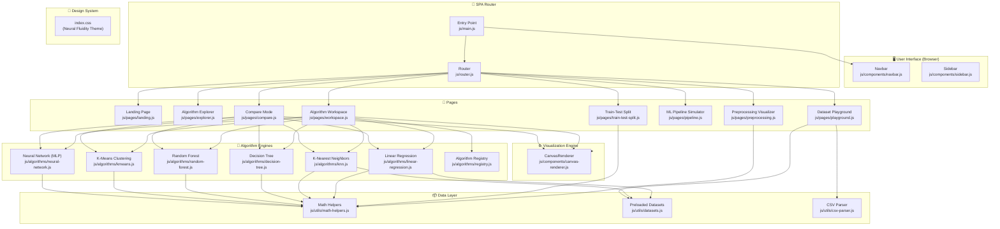

# Algonex — System Architecture

## Overview

Algonex is a client-side Single Page Application (SPA) built with **Vanilla JavaScript ES Modules**, **Vite** (bundler), and **HTML5 Canvas API**. There is no backend — all ML computations happen entirely in the browser.

---

## Architecture Diagram



---

## Data Flow

```
User interaction (slider / button)
        ↓
  Page Controller (workspace.js)
        ↓
  Algorithm Engine (e.g. knn.js)
   - step() / reset()
   - getMetrics() → metrics bar
   - getConfusionMatrix() → eval dashboard
   - getExplanation() → insight panel
   - getParamExplanation() → tooltip
        ↓
  CanvasRenderer.render()
   - drawGrid / drawAxes
   - drawDecisionBoundary (pixel-by-pixel predict)
   - drawPoints
        ↓
  HTML Canvas (visual output)
```

---

## Pages & Routes

| Route | Page | Description |
|---|---|---|
| `#landing` | Landing | Hero, feature overview, CTA |
| `#explorer` | Algorithm Explorer | Algorithm catalog cards |
| `#workspace/:algoId` | Workspace | Interactive ML visualization |
| `#preprocessing` | Preprocessing | Missing values & scaling demo |
| `#train-test-split` | Train/Test Split | Ratio slider + scatter recoloring |
| `#pipeline` | Pipeline Simulator | Step-by-step ML workflow guide |
| `#compare` | Compare Mode | Side-by-side algorithm comparison |
| `#playground` | Dataset Playground | CSV upload + dataset metadata |

---

## Algorithm Engines API

Each algorithm in `js/algorithms/` exports a factory function returning:

```js
{
  params,                    // slider config: { key: { value, min, max, step, label } }
  reset(paramValues),        // re-initialize with new params
  step(lr?),                 // advance one epoch/iteration
  render(renderer),          // draw to CanvasRenderer
  getExplanation(),          // { title, formula, currentStep, parameters, insight, theory }
  getMetrics(),              // { 'Accuracy': '94.2%', 'F1 Score': '93.1%', ... }
  getConfusionMatrix(),      // { matrix[][], classes[] } | null (regression)
  getParamExplanation(key, val), // dynamic tooltip string
  get data(),                // { points[][], labels[] }
  get epoch(),               // current iteration count
  get converged(),           // boolean (optional)
}
```

---

## Design System (Neural Fluidity)

Defined entirely in `css/index.css`:

| Token | Value |
|---|---|
| `--primary` | `#00d1ff` (cyan) |
| `--secondary` | `#d0bcff` (purple) |
| `--success` | `#34d399` (green) |
| `--warning` | `#fbbf24` (amber) |
| `--error` | `#ffb4ab` (red-pink) |
| `--font-headline` | `'Space Grotesk'` |
| `--font-body` | `'DM Sans'` |
| `--font-label` | `'Space Mono'` |
| Background | Dark navy `#050d1e` |
| Surface | Dark blue-grey `#0b1326` |
